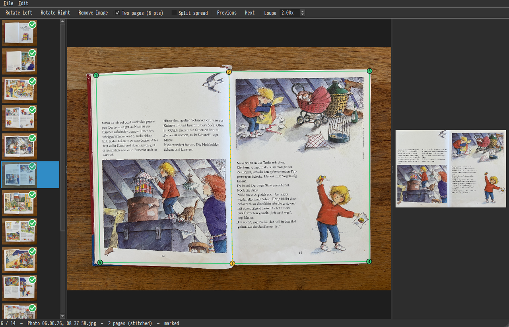

# wonderscan

A Linux desktop app to mark, perspective-correct (dewarp), and export
photographed book pages into a single PDF. C++ / Qt6 / OpenCV.



## Build

Dependencies (Ubuntu 24.04): `qt6-base-dev`, `libopencv-dev`, and
[ONNX Runtime](https://github.com/microsoft/onnxruntime/releases) (used by the
**Auto-detect Corners** feature; the system OpenCV is too old to run the model).

```bash
sudo apt install qt6-base-dev libopencv-dev    # qt6-base-dev usually already present

# ONNX Runtime: extract a linux-x64 release tarball somewhere, e.g.:
#   tar xzf onnxruntime-linux-x64-1.20.1.tgz -C ~/.local && \
#     ln -sfn ~/.local/onnxruntime-linux-x64-1.20.1 ~/.local/onnxruntime

cmake -S . -B build -DCMAKE_BUILD_TYPE=Release \
      -DONNXRUNTIME_ROOT="$HOME/.local/onnxruntime"   # default if omitted
cmake --build build -j"$(nproc)"
```

The binary is `build/wonderscan`. The page-detection model lives at
`models/page-seg.onnx`; see that file's provenance and retraining steps in the
training project's `README.md`.

## Install

Installs the binary, a `.desktop` launcher, and the app icon (hicolor theme),
so wonderscan appears in your application menu:

```bash
sudo cmake --install build
# updates to the menu/icon cache may need:
sudo update-desktop-database /usr/local/share/applications 2>/dev/null || true
gtk-update-icon-cache /usr/local/share/icons/hicolor 2>/dev/null || true
```

Use `--prefix ~/.local` for a per-user install (no `sudo`).

In VS Code, run **Terminal ▸ Run Task ▸ "wonderscan: install"** (installs to
`~/.local`, no sudo) — see `.vscode/tasks.json` for build / self-test / system
install tasks too.

## Run

```bash
./build/wonderscan            # or just `wonderscan` after installing
./build/wonderscan page1.jpg page2.jpg   # open files directly
```

### Headless self-test

Verifies the warp + PDF pipeline without a display:

```bash
QT_QPA_PLATFORM=offscreen ./build/wonderscan --selftest /tmp/out.pdf
```

## Workflow

1. **Add Images** (or **Add Folder**, or drag-drop) — JPEG / PNG / TIFF / BMP /
   WebP. iPhone HEIC must be converted to JPEG first.
2. Pick a page in the **filmstrip** (left). A green check marks pages whose
   corners are set.
3. **Rotate** the source upright if needed (`[` / `]`). *Note: rotating resets
   that image's corners.*
4. Choose **1 page** or **2 pages (6 pts)** per image (toolbar). For spreads,
   toggle **Split spread** (two pages) vs. stitched (one page). By default both
   halves of a spread are rendered at the same width (centred spine); turn this
   off in **Edit → Settings** to keep each half's measured width.
5. Drag the **corner handles** onto the page edges, or select one by its number
   (`1`–`4`, or `1`–`6` for a spread — each handle is labelled; `Tab` /
   `Shift+Tab` step through them) and nudge it with the **arrow keys** (hold two,
   e.g. Up+Left, to move diagonally; `Shift` and `Ctrl+Shift` give larger steps;
   `Esc` to deselect). The **loupe** helps
   you place them precisely. Nudge step sizes and the loupe zoom are set in
   **Edit → Settings** (and remembered between sessions). When consecutive shots
   share the same framing, press `Ctrl+D` to reuse the previous image's corners
   on the current one as a starting point. Or press `Ctrl+Shift+D`
   (**Edit → Auto-detect Corners**) to have the page corners found automatically
   — one page becomes a 4-point quad, a two-page spread becomes a 6-point spread;
   then fine-tune by nudging. (Rotate the image upright first — the detector
   expects upright pages.) To pre-fill a whole batch at once, use
   **Edit → Auto-detect Corners on All Images**.
6. The **preview pane** (right) shows the rectified result live.
7. **Remove** an unwanted image with `Delete`, the toolbar button, or
   right-click → Remove in the filmstrip (removes it from the project only —
   the file on disk is untouched). **Reorder** pages with `Alt+↑` / `Alt+↓`
   (or right-click → Move Up / Move Down) — pages export in filmstrip order.
8. **Save Project** (`Ctrl+S`) to store your corners/rotation/mode as a `.wsp`
   JSON file you can reopen later. Recently used projects are listed under
   **File → Open Recent**, and the open/save/export dialogs reopen in the last
   folder you used.
9. **Export PDF** (`Ctrl+E`) — choose DPI + JPEG quality. Unmarked images are
   skipped (with a warning). Pages come out in filmstrip order.

## Keyboard

| Action            | Shortcut        |
|-------------------|-----------------|
| Open project      | `Ctrl+O`        |
| Save project      | `Ctrl+S`        |
| Export PDF        | `Ctrl+E`        |
| Rotate left/right | `[` / `]`       |
| Remove image      | `Delete`        |
| Move image up/down | `Alt+↑` / `Alt+↓` |
| Previous / next   | `p` / `n`       |
| Select corner     | `1`–`6`         |
| Cycle corners     | `Tab` / `Shift+Tab` |
| Nudge corner      | Arrow keys (hold two for diagonal; `Shift` / `Ctrl+Shift` = larger steps) |
| Deselect corner   | `Esc`           |
| Copy corners from previous | `Ctrl+D` |
| Auto-detect corners | `Ctrl+Shift+D` |

Nudge step sizes, loupe zoom, and equal-width spreads are configurable in
**Edit → Settings**.
